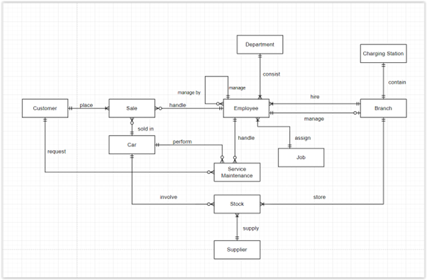
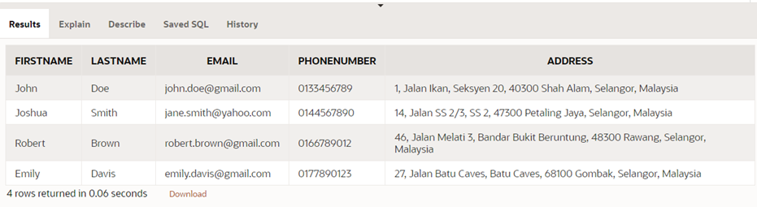
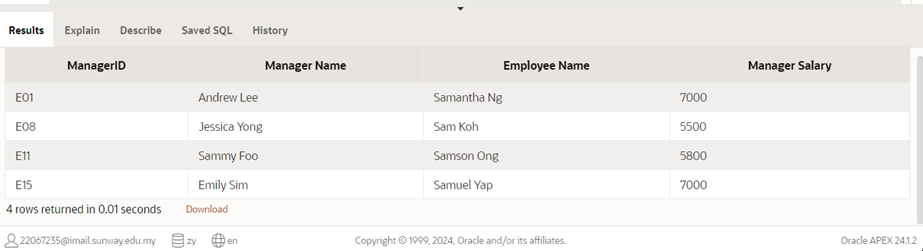
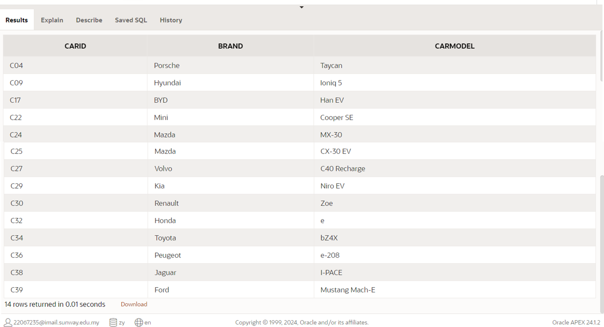
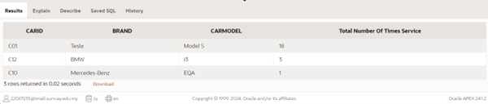

# GreenMotors Database Project

GreenMotors is an electric car dealership in Selangor committed to promoting sustainable transportation.  
This repository contains the **database schema**, **ER diagram**, and **business queries** designed to manage and analyze the operations of GreenMotors.

---

## 🚀 Objective

To streamline operations and enhance customer experience, GreenMotors developed a robust database system to manage:

- Electric car data  
- Customer data  
- Sales data  
- Stock and supplier data  
- Service maintenance data  
- Department, employee, and job data  
- Dealership branch and charging station data  

This database enables efficient tracking of inventory, sales performance, customer service, and employee management.

---

## 🗂️ Scenario Overview

GreenMotors operates several dealership branches throughout Selangor, offering electric cars from Tesla, Nissan, BMW and others.  
Key features of the database include:

- **Car Table**: Tracks details like Car ID, brand, model, manufacture date, battery capacity, range, price, and status.
- **Dealer Branch Table**: Stores branch ID, location, contact, and branch manager.
- **Supplier & Stock Tables**: Record supplier information and stock quantity at each branch.
- **Sales Table**: Logs sales transactions (sale ID, car ID, customer ID, employee ID, date/time, amount).
- **Service Maintenance Table**: Tracks all maintenance services for each car.
- **Customer Table**: Stores customer contact details for marketing and after-sales communication.
- **Employee, Department, Job Tables**: Manage employee details, departments, job roles, and reporting structure.
- **Charging Station Table**: Tracks number of chargers and charging speeds per branch.

---

## 📂 Repository Contents

| File / Folder             | Description |
|---------------------------|-------------|
| `erd.png`                 | Entity Relationship Diagram of the GreenMotors database |
| `schema.sql`              | SQL script to create tables and constraints |
| `sample_data.sql`         | (Optional) Sample data for testing queries |
| `business_queries.sql`    | Collection of real-world business queries with comments |
| `screenshots/`            | (Optional) Screenshots of query outputs |
| `outputs/`                | (Optional) CSV or text files showing query results |

---

## 💡 Example Business Queries

The `business_queries.sql` file includes commented queries such as:

1. **Tesla Promotion** – Retrieve customers eligible for a limited-edition umbrella gift.
2. **Luxury German Cars by Branch** – Evaluate sales of luxury German cars by non-managerial staff.
3. **Manager Salary Raise** – Identify an employee by partial name and retrieve their manager’s details.
4. **Cars in Stock Never Sold** – Identify cars currently in stock but never sold.
5. **Cars <1 Year Old with Highest Service Count** – Find the most frequently serviced cars under one year old.

Each query is preceded by comments explaining the **business goal** and the **logic** behind it.

---

## 🖼️ ER Diagram

---

## 📸 Query Output Examples

You can find screenshots of selected query results in the [`/screenshots`](screenshots) folder.  
Below are some embedded examples:

### Tesla Promotion Query Result  

---

### Luxury German Cars by Branch Result  

---

### 3️⃣ Manager Salary Raise – Employee “Sam” and Their Manager  

---

### 4️⃣ Cars in Stock Never Sold  

---

### 5️⃣ Cars <1 Year Old with Highest Service Count  

